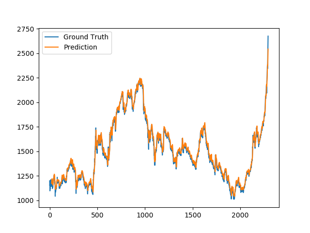
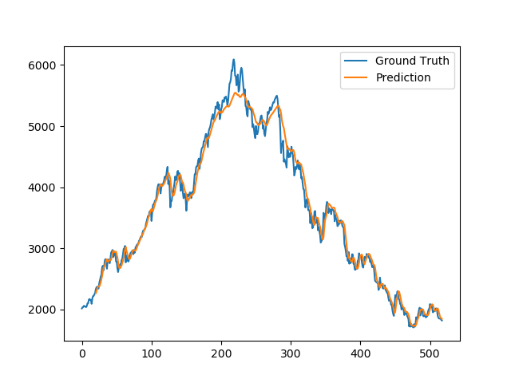

# Stock Market Prediction using LSTM <br> in Vintage Implementation Environment

We use [SSE index data](https://finance.yahoo.com/quote/000001.SS/history?period1=867801600&period2=1623283200&interval=1d&filter=history&frequency=1d&includeAdjustedClose=true) from 1997 to 2006 as training data, and predict stock market date in the next two years (i.e., 2007 and 2008). 

We trained the [LSTM](https://link.springer.com/chapter/10.1007/3-540-44668-0_93) (RNN) model for prediction using an old GPU for accelaration via Theano.

<div style="display: flex">
  
  
</div>
<div style="display: flex; flex-direction: row;">
  <li style="display:inline; float: center; margin-right: 10px;" width="45%" > [Left] Training set prediction (1997-2006)</>
  <li style="display:inline; float: center; margin-right: 10px;" width="45%" > [Right] Testing set prediction (2007-2008)</>
</div>

## Specifications
OS: Windows 7 (64 bit)

GPU: 
  - Hardware: 1 x NVIDIA GeForece 8800 GTX 
  - CUDA driver version: 5.5
  - CUDA computing capability : 1.0 (CUDA <= v6)
  - 128 CUDA cores (8 cuda cores * 16 multiprocessors)
  - Max \#threads per multiprocessor = 768 

  VC Compiler: Microsoft Visual Studio 2010
  
Program language: Python 2.7
Python libraries:
  - Theano 0.7.0
  - Keras 0.3.2  

## Instructions 
I tested in Win 7 64bit only

### Quick setup

0. Set up Windows 7 OS 


1. Install MSVS 2010 and CUDA 5.5


2. Install Python environment


- Install Anaconda 2.1.0


- Install Dependencies

[optinal] Create your own python virtual environment:
```
create -n stock_pred
activate stock_pred
```

Install MinGW via conda:
```
conda install mingw libpython 
```

Install Theano, Keras and other libraries:
```
pip install Theano==0.7.0 keras==0.3.2 nose pandas matplotlib h5py scikit-learn
```

Edit Theano config file in C:/Users/USER_NAME/.theanorc.txt
```
[blas] 
ldflags=

[global]
openmp = False
device = gpu0
floatX = float32
allow_input_downcast = True


[gcc]
cxxflags = -IC:\Users\USER_NAME\Anaconda\envs\stock_pred\MinGW\include

[nvcc]
fastmath=True
flags = -LC:\Users\USER_NAME\Anaconda\envs\stock_pred\libs
compiler_bindir=C:\Program Files (x86)\Microsoft Visual Studio 10.0\VC\bin
flags = -arch=sm_30
flags = -optimizer=fast_compile
```

### Quick start
### 1. Clone source code
Install [git](https://git-scm.com/downloads).

```
git clone https://github.com/chenyingshu/ray_tracer_2007.git
cd Deep_Learning_Prediction
```

### 2. Inference with pretrained model 
Two modes:

**Non-iterative**
```
python Keras-LSTM.py --mode test
```

**Iterative**
```
python Keras-LSTM.py --mode test --test-mode iter
```


### 3. Training

## Results

## Algorithm and Implementation Details
Training data: 

X = <N, past_days, 1>

Y = <N, 1>

Network Architecture

ref: https://github.com/Kulbear/stock-prediction/blob/master/stock-prediction.ipynb

2-layer LSTM

## Reference
**LSTM for prediction:**

Gers, F. A., Eck, D., & Schmidhuber, J. (2001). Applying LSTM to time series predictable through time-window approaches. International Conference on Artificial Networks 2001 (pp. 669-676). Retrieved from https://link.springer.com/chapter/10.1007/3-540-44668-0_93. 

**LSTM Implementation in Python using Keras:**

Time Series Prediction with LSTM Recurrent Neural Networks in Python with Keras:
https://machinelearningmastery.com/time-series-prediction-lstm-recurrent-neural-networks-python-keras/

Stock Prediction with Recurrent Neural Network: 
https://github.com/Kulbear/stock-prediction/blob/master/stock-prediction.ipynb


