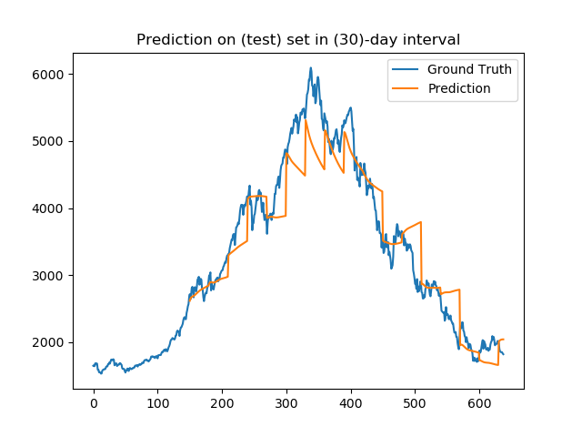

# Stock Market Prediction using LSTM <br> in Vintage Implementation Environment

We use [SSE index data](https://finance.yahoo.com/quote/000001.SS/history?period1=867801600&period2=1623283200&interval=1d&filter=history&frequency=1d&includeAdjustedClose=true) from 1997 to 2006 as training data, and predict stock market date in the next two years (i.e., 2007 and 2008). 

We trained the [LSTM](https://link.springer.com/chapter/10.1007/3-540-44668-0_93) (RNN) model for prediction using an old GPU for accelaration via Theano.


<table style="">
  <tr>
    <td></td>
    <td></td>
  </tr>
  <tr>
    <th> Training set prediction (1997-2006) </th>
    <th> Testing set prediction (2007-2008) </th>
  </tr>
</table>
<!-- <div style="display: flex; flex-direction: row;">
  <div style="display:flex; float: center; margin-right: 10px;" width="45%" > [Left] Training set prediction (1997-2006)</>
  <div style="display:flex; float: center; margin-right: 10px;" width="45%" > [Right] Testing set prediction (2007-2008)</>
</div> -->

## Specifications
OS: Windows 7 (64 bit)

GPU: 
  - Hardware: 1 x NVIDIA GeForece 8800 GTX 
  - Memory 732MB
  - CUDA driver version: 5.5
  - CUDA computing capability : 1.0 (CUDA <= v6)
  - 128 CUDA cores (8 cuda cores * 16 multiprocessors)
  - Max \#threads per multiprocessor = 768 

  VC Compiler: Microsoft Visual Studio 2010
  
Program language: Python 2.7
Python libraries:
  - Theano 0.7.0
  - Keras 0.3.2  

## Instructions 
I tested in Win 7 64bit only

### Quick setup

0. Set up Windows 7 OS 


1. Install MSVS 2010 and CUDA 5.5


2. Install Python environment


- Install Anaconda 2.1.0


- Install Dependencies

[optinal] Create your own python virtual environment:
```
create -n stock_pred
activate stock_pred
```

Install MinGW via conda:
```
conda install mingw libpython 
```

Install Theano, Keras and other libraries:
```
pip install Theano==0.7.0 keras==0.3.2 nose pandas matplotlib h5py scikit-learn
```

Edit Theano config file in C:/Users/USER_NAME/.theanorc.txt
```
[blas] 
ldflags=

[global]
openmp = False
device = gpu0
floatX = float32
allow_input_downcast = True


[gcc]
cxxflags = -IC:\Users\USER_NAME\Anaconda\envs\stock_pred\MinGW\include

[nvcc]
fastmath=True
flags = -LC:\Users\USER_NAME\Anaconda\envs\stock_pred\libs
compiler_bindir=C:\Program Files (x86)\Microsoft Visual Studio 10.0\VC\bin
flags = -arch=sm_30
flags = -optimizer=fast_compile
```

### Quick start
### 1. Clone source code
Install [git](https://git-scm.com/downloads).

```
git clone https://github.com/chenyingshu/ray_tracer_2007.git
cd Deep_Learning_Prediction
```

### 2. Inference with pretrained model 
Two modes:

**Non-iterative**

Predict everyday (default amend_num = 1).
```
python Keras-LSTM.py --mode test
```

**Iterative**

Predict every N (integer) days. 

Use past {real N-day data{ to predict 1st-day datum,

use past {real (N-1)-day data + predicted 1-day datum} to predict 2nd-day datum,

use past {real (N-2)-day data + predicted 2-day data} to predict 3rd-day datum,

...

use past {real 1-day datum + predicted (N-1)-day data} to predict Nth-day datum.
```
python Keras-LSTM.py --mode test --amend_num N
```


### 3. Training

For exampel, train with every past 30-day data and predict 31st day datum.
```
python Keras-LSTM.py --past_days 30 --epoch 1500 --batch 768
```

## Results

### Predictions from 1997 to 2006 (training set).
<table>
   <tr>
    <th colspan='4'>Prediction daily - #Past days</th>
  </tr>
  <tr>
    <th>7</th>
    <th>30</th>
    <th>90</th>
    <th>150</th>
  </tr>
  <tr>
    <td></td>
    <td>
    <td>
    <td>
  </tr>
</table>

### Predictions from 2007 to 2008 (test set).

<table>
  <tr>
    <th rowspan='2'>#Past</th>
    <th colspan='4'>Prediction - amendment interval</th>
  </tr>
  <tr>
    <th>1</th>
    <th>7</th>
    <th>30</th>
    <th>90</th>
  </tr>
  <tr>
    <td>7</td>
    <td></td>
    <td>
    <td>
    <td>
  </tr>
  <tr>
    <td>30</td>
    <td></td>
    <td>
    <td>
    <td>
  </tr>
  <tr>
    <td>90</td>
    <td></td>
    <td></td>
    <td></td>
    <td></td>
  </tr>
  <tr>
    <td>150</td>
    <td></td>
    <td></td>
    <td></td>
    <td></td>
  </tr>
</table>


## Algorithm and Implementation Details
### Training data: 

- X = <N, past_days, 1>
- Y = <N, 1>

### Network Architecture
2-layer LSTM

layers = <feature-dim:x, window-size:w, 100:n, output-dim:y>

- feature-dim: 1 (only use close price)
- window-size: look_back days
- Layer 2 nodes: 100 (manual-defined)
- output-dim: 1 (only output close price)
- e.g., 1->7->100->1
  
Whole architecture:

in_feature_dim(x)  =>  window_size(w) -> dropout(0.4) => 100(n) -> dropout(0.3) => out_dim(y) -> activate(linear)

Loss: MSE

Optimizer: rmsprop

ref: https://github.com/Kulbear/stock-prediction/blob/master/stock-prediction.ipynb


## Reference
**LSTM for prediction:**

Gers, F. A., Eck, D., & Schmidhuber, J. (2001). Applying LSTM to time series predictable through time-window approaches. International Conference on Artificial Networks 2001 (pp. 669-676). Retrieved from https://link.springer.com/chapter/10.1007/3-540-44668-0_93. 

**LSTM Implementation in Python using Keras:**

Time Series Prediction with LSTM Recurrent Neural Networks in Python with Keras:
https://machinelearningmastery.com/time-series-prediction-lstm-recurrent-neural-networks-python-keras/

Stock Prediction with Recurrent Neural Network: 
https://github.com/Kulbear/stock-prediction/blob/master/stock-prediction.ipynb


